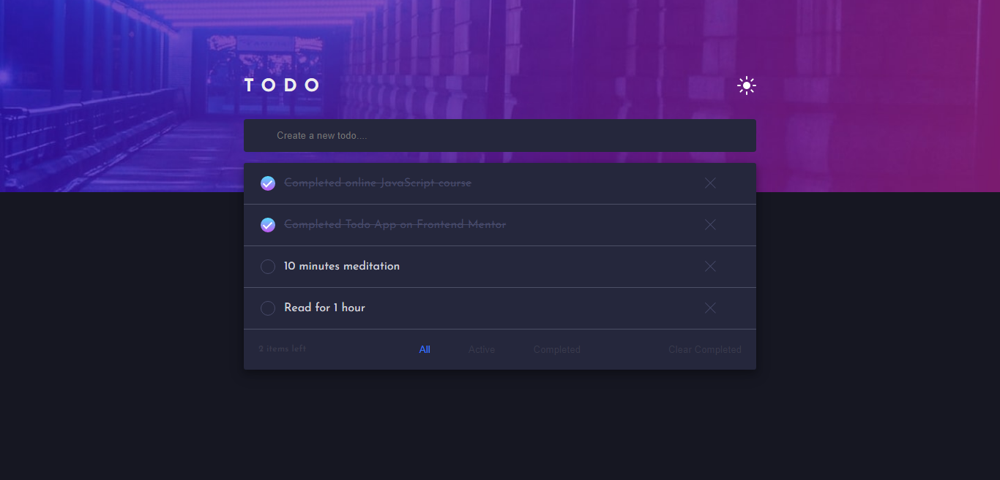
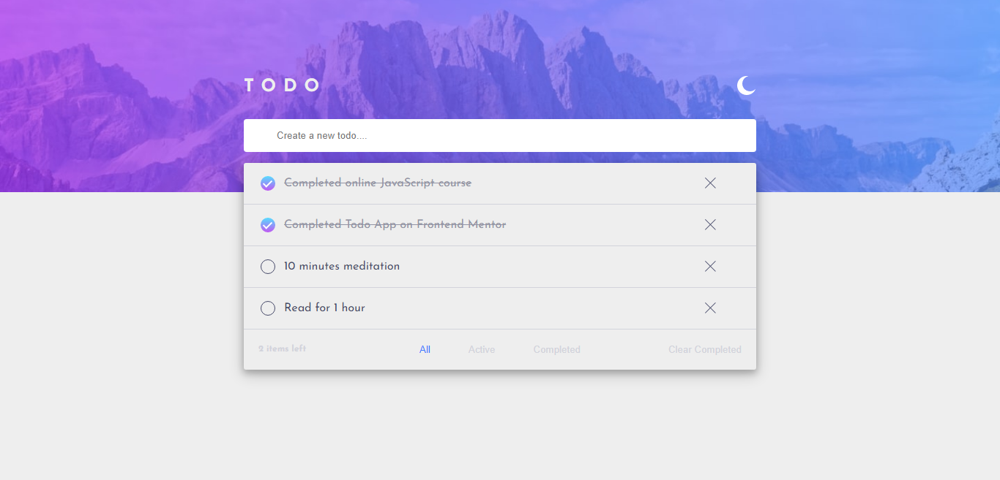

### Links

- Solution URL: [https://www.frontendmentor.io/solutions/todo-app-using-vue-3-8AZ8avWI7c]
- Live Site URL: [https://todo-angular-three.vercel.app/]

### The challenge

Users should be able to:

- View the optimal layout for the app depending on their device's screen size
- Add new todos to the list
- Mark todos as complete
- Delete todos from the list
- Filter by all/active/complete todos
- Clear all completed todos
- Toggle light and dark mode

### Screenshot

### Built with

- HTML
- CSS
- Angular 17

# Frontend Mentor - Todo app solution

This is a solution to the [Todo app challenge on Frontend Mentor](https://www.frontendmentor.io/challenges/todo-app-Su1_KokOW).
